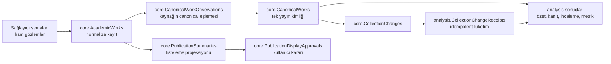

# Veritabanı rehberi

Bu veritabanı ilk bakışta büyük görünür. Bibliyografik başlık, yazar, yıl ve kimlik alanları bazı tablolarda gerçekten örtüşür; bunlar çoğunlukla ham gözlem, normalize kayıt, canonical kimlik ve okuma projeksiyonu gibi farklı yaşam döngüsü seviyeleridir. İki bağımsız servis aynı SQL Server veritabanında çalışıyor ve her biri kendi migration geçmişini, sağlayıcı verisini, kalıcı iş durumunu ve denetlenebilir sonuçlarını saklıyor. [Başlangıç envanteri testi](../ResearcherAnalysisService.Tests/ServiceStartupBoundarySmokeTests.cs) 37 collector ve 30 analysis iş tablosunu doğrular. Bunlara `dbo.VersionInfo` ve `dbo.ResearcherAnalysisVersionInfo` eklenince fiziksel toplam 69 olur.

Karar: mevcut 67 iş tablosu korunmalı. İncelemede güvenle kaldırılabilecek kullanılmayan veya aynı sözleşmeyi taşıyan bir tablo bulunmadı. Tablo silmek görünümü sadeleştirirken yeniden başlatılabilir işleri, kaynak izini, kullanıcı onayını veya geçmiş sonuçları kaybettirir. Şema adları ana organizasyon sınırıdır; günlük kullanımda ilgili şemaya göre filtrelemek gezinmeyi kolaylaştırır.

## Sorumluluk haritası

| Sahip / şema | Sayı | Tablolar | Neden ayrı? |
| --- | ---: | --- | --- |
| Collector çekirdek (`core`) | 13 | `Researchers`, `AcademicWorks`, `AcademicWorkSources`, `AcademicWorkResearchContexts`, `AcademicWorkTopics`, `PublicationSummaries`, `PublicationDisplayApprovals`, `CanonicalWorks`, `CanonicalWorkDoiAliases`, `CanonicalWorkDoiRelations`, `CanonicalWorkObservations`, `CanonicalResearcherWorks`, `CollectionChanges` | Araştırmacı, normalize kayıt, gösterim projeksiyonu, canonical kimlik ve servisler arası değişiklik akışı farklı yaşam döngülerine sahiptir. |
| Sağlayıcı kaynakları | 16 | `orcid`: 2; `googlescholar`: 2; `openalex`: 2; `wos`: 3; `yoksis`: 1; `trdizin`: 2; `crossref`: 1; `semanticscholar`: 3 | Sağlayıcıya özgü kimlikleri ve alanları kayıpsız tutar; toplama tekrar oynatılabilir ve normalizasyon denetlenebilir kalır. |
| Collector çalışma durumu | 4 | `bulk.BulkCollectionBatches`, `bulk.BulkCollectionJobs`, `integrations.ProviderRequestBudgets`, `integrations.ProviderStatusObservations` | Kuyruk, yeniden deneme, hız bütçesi ve sağlık geçmişi kaynak veriden farklı saklama/temizlik politikası ister. |
| Analysis (`analysis`) | 26 | Aşağıdaki ürün grupları | Model girdisi, kanıt, deneme ve sonuç geçmişi yeniden üretilebilirlik için normalleştirilmiştir. |
| İK (`hr`) | 2 | `EvidenceDossiers`, `DossierReviewActions` | Dosya ile sonradan eklenen insan inceleme günlüğünün değişmezliği farklıdır. |
| Fakülte (`faculty`) | 2 | `AssistantContextVersions`, `AssistantRuns` | Özel bağlam sürümleri ile bunlara sabitlenmiş çalışma sonuçları ayrı erişim ve saklama sınırlarıdır. |

Analysis içindeki 26 tablo şu iş kümelerine ayrılır:

- Araştırmacı ve model kullanımı (2): `ResearcherAnalyses`, `GeminiUsageAttempts`.
- Makale özeti ve kanıt (8): `ArticleSummaries`, `ArticleSourceSnapshots`, `ArticleSourcePages`, `ArticleSourceSpans`, `CanonicalArticleAnalysisRuns`, `CanonicalArticleClaims`, `CanonicalArticleClaimEvidence`, `ArticleSummaryAutomationJobs`.
- Makale inceleme (5): `CanonicalArticleReviewRuns`, `CanonicalArticleReviewFindings`, `CanonicalArticleReviewEvidence`, `ArticleReviewWorkItems`, `ArticleReviewStageCheckpoints`.
- Değerlendirme (5): `ArticleEvaluationRuns`, `ArticleEvaluationCases`, `ArticleEvaluationWorkItems`, `ArticleEvaluationAttempts`, `ArticleEvaluationResults`.
- Metrik ve referans nüfusu (5): `PublicationMetricSnapshots`, `PublicationMetricProviderSnapshots`, `PublicationMetricsRefreshStates`, `ReferencePopulationManifests`, `ReferencePopulationMembers`.
- Collector değişiklik tüketimi (1): `CollectionChangeReceipts`.



## Benzer görünen tablolar

`core.PublicationSummaries` ile `analysis.ArticleSummaries` bibliyografik kimlik bakımından örtüşür, fakat aynı yaşam döngüsünü taşımaz. `PublicationSummaries`, collector tarafından `AcademicWorks` üzerinden güncellenen hızlı yayın listeleme projeksiyonudur; UI ve kullanıcı gösterim onayları bunu kullanır. Bu yazma ve silme uzlaştırması [PublicationSummarySynchronizer](../Modules/AcademicPerformance/Service/Works/Processing/PublicationSummarySynchronizer.cs) içinde görülebilir. `ArticleSummaries` ise Analysis Service'in belirli araştırmacı/makale için ürettiği kalıcı model sonucudur. [ResearcherAnalysisWorkflow](../ResearcherAnalysisService/Products/Analysis/ResearcherAnalysisWorkflow.cs) her ikisini de okur: önce yayın envanteri, sonra varsa doğrulanmış makale özeti.

Sağlayıcı work tabloları, `core.AcademicWorks` ve `core.CanonicalWorks` ortak yayın alanları taşır; farklı kaynak ve uzlaştırma seviyelerini temsil eder. Sağlayıcı tabloları dış kaynağın kayıpsız gözlemidir. `AcademicWorks` sağlayıcı verisini ortak forma çevirir. `CanonicalWorks` aynı yayına ait birden fazla normalize kaydı bir kimlik altında toplar; `CanonicalWorkObservations` hangi kaynak kaydının hangi canonical kayda bağlandığını, `CanonicalResearcherWorks` ise araştırmacı sahipliğini açıkça tutar. Birleştirme ve ilişki güncelleme davranışı [CanonicalWorkSynchronizer](../Modules/AcademicPerformance/Service/Works/Processing/CanonicalWorkSynchronizer.cs) içindedir.

Analysis Service içindeki `SourceData` EF sınıfları yeni tablo oluşturmaz. Bunlar collector'ın `core` ve sağlayıcı tablolarına yapılan özel, salt-okunur eşlemelerdir. [AnalysisDbContext yazma koruması](../ResearcherAnalysisService/Products/Data/AnalysisDbContext.cs) bu modellerde değişikliği reddeder; Analysis yalnızca kendi `analysis`, `hr` ve `faculty` tablolarını değiştirir. Servisler arasında foreign key olmaması da her servisin kendi migration'ıyla tek başına veya eşzamanlı başlayabilmesini sağlar.

İş, deneme ve checkpoint tabloları yalnızca log değildir. `BulkCollectionJobs`, `ArticleSummaryAutomationJobs`, `ArticleReviewWorkItems`, `ArticleReviewStageCheckpoints`, `ArticleEvaluationWorkItems`, `ArticleEvaluationAttempts` ve `PublicationMetricsRefreshStates`; çökme sonrası devam, üst sınırı belli yeniden deneme, aynı isteğin iki kez çalışmasını önleme ve eski bir çalışmanın yeni sonucu ezmesini engelleme için okunup yazılır. Kanıt tabloları da model çıktısının hangi snapshot, sayfa ve span ile desteklendiğini korur.

## Gerçekçi sadeleştirme adayları

En yakın işlevsel örtüşme `PublicationSummaries` projeksiyonu ile canonical yayın okuma modelidir.
Yine de mevcut UI ve API'ler summary kimliğini kullanır; `PublicationDisplayApprovals` da bu kimliğe
bağlı kullanıcı kararını saklar. Canlı canonical sorguya geçiş tek tablo silme işi değildir: approval
kimliklerinin taşınması, aynı araştırmacıya ait gösterim sırasının ve fingerprint davranışının
korunması, çift-okuma dönemi ve veri eşitliği kontrolü gerekir. Ölçülmüş bir tutarsızlık veya bakım
maliyeti çıkarsa ilk incelenecek aday budur; mevcut kanıtla hemen birleştirilmemelidir.

| Aday | Kazanç | Bedel / risk | Öneri |
| --- | --- | --- | --- |
| `PublicationSummaries` tablosunu view veya canlı sorgu yapmak | Bir tablo azalır | Mevcut fingerprint, UI okuma hızı, silinen kayıt uzlaştırması ve `PublicationDisplayApprovals` ilişkisi yeniden tasarlanır | Yapmayın; ölçülmüş tutarsızlık veya bakım sorunu yok. |
| Beş sağlayıcının profile/work çiftini ortak `Profiles`/`Works` tablolarına taşımak | Bu 10 tablo 2 tabloya iner; diğer sağlayıcı tabloları kalır | Provider alanları JSON/nullable kolonlara taşınır; benzersizlik ve foreign key kuralları zayıflar; tüm sync kodu ve mevcut veri dönüştürülür | Sayıyı 8 düşürür fakat modeli sadeleştirmez; yapmayın. Yeni sağlayıcı sayısı ciddi biçimde büyürse yeniden ölçün. |
| `ArticleSummaries` sonucunu `CanonicalArticleAnalysisRuns` içine almak | Bir tablo azalır | Eski API uyumluluğu, birden fazla koşunun geçmişi ve mevcut foreign key/veri geçişi karmaşıklaşır | Yeni yazımlarda eski tablo artık kullanılmıyorsa önce kullanım telemetrisi ve çift-okuma migration planı hazırlayın; bugün birleştirmeyin. |
| Page/span/claim/evidence satırlarını JSON'a gömmek | Dört-altı tablo azalabilir | Kaynak bütünlüğü, hedefli sorgu, graph export, kanıt tekrar kullanımı ve satır bazlı doğrulama kaybolur | Yapmayın. Bu ayrım ürünün denetlenebilirlik özelliğidir. |
| Tüm kuyrukları ortak `Jobs` tablosuna taşımak | Birkaç tablo azalır | Her iş tipinin claim tokenı, retry, bağımlılık ve sonuç sözleşmesi farklıdır; geniş nullable/JSON şema oluşur | Yapmayın; ortak kod gerekirse tabloyu değil işlem yardımcılarını paylaşın. |
| Eski veriyi süreye göre arşivlemek | Aktif tablo boyutu ve indeks maliyeti düşebilir | Denetim ve tekrar üretme süresi kısalır; saklama gereksinimi bilinmeden veri kaybı riski vardır | Tablo sayısı için değil, ölçülmüş hacim için değerlendirin; önce ürün bazlı saklama politikası belirleyin. |

En düşük riskli iyileştirme fiziksel şemayı değiştirmek değil, operasyon araçlarında şema filtresi ve bu sorumluluk haritasını kullanmaktır. Birleştirme ancak satır hacmi, sorgu maliyeti, bakım olayı ve saklama zorunluluğu ölçülerek ayrı bir migration projesi olarak yapılmalıdır. Böyle bir migration; geri doldurma, iki sürümle uyumlu okuma, bütünlük karşılaştırması, geri alma planı ve geçmiş veri koruması olmadan uygulanmamalıdır.

## Salt-okunur envanter sorgusu

Aşağıdaki sorgu uygulama verisini okumaz; yalnızca tablo adlarını ve satır sayısı tahminlerini şemaya göre listeler. Hedef bağlantının doğru ve yetkili bir bakım bağlantısı olduğunu ayrıca doğrulayın.

```sql
SELECT
    s.name AS SchemaName,
    t.name AS TableName,
    SUM(CASE WHEN p.index_id IN (0, 1) THEN p.rows ELSE 0 END) AS ApproximateRows
FROM sys.tables AS t
JOIN sys.schemas AS s ON s.schema_id = t.schema_id
LEFT JOIN sys.partitions AS p ON p.object_id = t.object_id
GROUP BY s.name, t.name
ORDER BY s.name, t.name;
```
