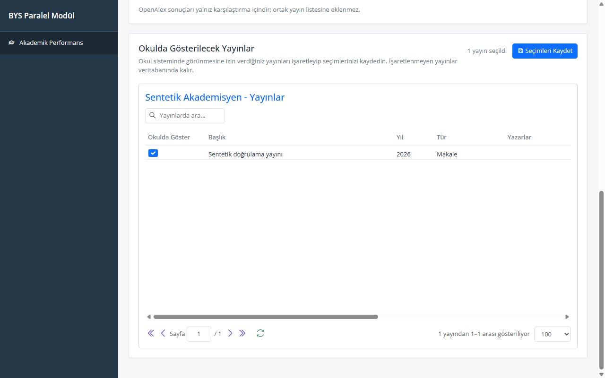

# Proje incelemesi — 5 Eylül 2026

## Karar

Host, sürümlü API, uygulama servisi, sağlayıcı entegrasyonları ve kalıcılık
katmanları ayrı sorumluluklara sahip. Tüm projeyi sıfırdan yazmak gerekmiyor.
Yayın tekilleştirme algoritması yeniden düzenlendi; veri kaybı, kimlik doğrulama
ve yanıt işleme hataları hedefli olarak düzeltildi. Mevcut SQL Server şeması
ve uygulanmış migration'lar değiştirilmedi.

## Düzeltilen bulgular

| Alan | Hata ve düzeltilen davranış |
| --- | --- |
| Kimlik ayrıştırma | Adlandırılmış ORCID ve ResearcherID değerleri doğrulamayı atlayabiliyordu. Tüm girişler aynı biçim ve normalizasyon kurallarından geçiyor. |
| V1 toplama | ORCID alanına ResearcherID yazıldığında başka sağlayıcıya yönlenebiliyordu. İstek alanının türü korunuyor ve yanlış tür reddediliyor. |
| Akademisyen eşleştirme | Kimliklerin farklı mevcut akademisyenlere ait olduğu durumda ilk kayıt seçiliyordu. Çakışma veri toplamadan önce reddediliyor. |
| Yayın tekilleştirme | DOI'siz kayıt iki farklı DOI'yi birleştirebiliyor veya aynı DOI için birden fazla özet üretip SQL unique index hatasına yol açabiliyordu. DOI grupları önce oluşturuluyor; belirsiz başlık eşleşmeleri ayrı tutuluyor. |
| Eksik yayın metadatası | Başlığı ve DOI'si olmayan yayınlar aynı fingerprint'i alıyordu. Kaynak kayıt kimliği ile ayrı, kararlı özetler üretiliyor. |
| Yayın onayları | Gruplar birleştiğinde tercih edilen başlığın değişmesi onayı düşürebiliyordu. Tek anlamlı eşleşmede mevcut onaylı özet korunuyor; belirsiz eşleşmede onay başka yayına taşınmıyor. |
| DOI normalizasyonu | `dx.doi.org` bağlantıları düz DOI'den ayrı sayılıyordu. Eski ve yeni DOI URL biçimleri normalize ediliyor. |
| YÖKSİS artımlı güncelleme | `UpdatedAfter` ile gelen kısmi liste tam liste gibi işlenip eski kayıtlar, yayınlar ve onaylar silinebiliyordu. Artımlı güncelleme yalnız gelen kayıtları güncelliyor. |
| YÖKSİS eksik eser ID | ID'siz eserlerin tamamı tek gruba düşüyordu. Eser türü ve metadatadan kararlı bir yedek kimlik oluşturuluyor. |
| YÖKSİS hassas yanıt | Başarılı SOAP yanıtları içindeki geri yansıtılmış T.C. kimlik numarası ve kimlik bilgileri korunabiliyordu. Kayıt alanları, sonuç mesajı ve ham XML çıkarılmadan önce maskeleme uygulanıyor. |
| ORCID yanıtı | İsteğe bağlı bölümler yokken `GetRawText()` hata veriyordu. Eksik bölümler null olarak ele alınıyor; geçersiz yıl tarih oluşturmayı düşürmüyor. |
| OpenAlex sayacı | Profil tekrar okunurken toplanmış eser sayısı yerine sağlayıcının toplam sayısı gösteriliyordu. Kaydedilmiş eser sayısı SQL üzerinden hesaplanıyor. |
| Web of Science | Yapılandırılmış tek veritabanlı önbellek kullanılmıyor ve sayfalama sınırsız kalabiliyordu. Önbellek seçili veritabanlarını izliyor; varsayılan 100 sayfa sınırı uygulanıyor. |
| Arayüz kimlikleri | Hatırlanan kimlikler yüklenirken önceki aramadaki diğer sağlayıcı kimlikleri kalıyordu. Eski alanlar temizleniyor ve bozuk localStorage güvenle ele alınıyor. |
| Arayüz durumu | Yeni araştırma sırasında eski akademisyenin grid'i kalabiliyordu. Grid ve seçim durumu sıfırlanıyor; kimlik alanları işlem bitene kadar kilitleniyor. |
| Arayüz metinleri | Grid araması ve sayfalama alanında çeviri anahtarları görünüyordu. Kontroller oluşturulmadan önce Türkçe metinler kaydediliyor. |
| Doğrulama | Paketleme başarılı olsa da dört TypeScript tip hatası tespit edilmiyordu. Tipler düzeltildi; CI'a tip kontrolü, ön yüz testleri, xUnit ve gerçek SQL Server testleri eklendi. |
| Host yapılandırması | User Secrets her ortamda yükleniyordu. Artık yalnız Development ortamında yükleniyor; test host'u Testing ortamında açılıyor. |

## Doğrulama

İlk 19 regresyon senaryosunun 16'sı düzeltme öncesinde başarısızdı.
Düzeltmelerden sonra genişletilmiş 24 C# testi ve 7 ön yüz testi geçti.
SQL testleri gerçek FluentMigrator zincirini boş bir test veritabanında uygular;
HTTP testi gerçek host process'inde GetResearcher, ListPublications ve geçersiz
Collect isteğini doğrular. Sağlayıcı yanıtları sentetiktir; ücretli servisler ve
gerçek kişisel veriler kullanılmaz.

Tarayıcıda sentetik API yanıtlarıyla bozuk localStorage temizliği, araştırma
sırasında alanların kilitlenmesi, eski yayın ve seçimlerin temizlenmesi, kayıtlı
onayın yüklenmesi ve Türkçe grid metinleri doğrulandı. Serenity statik dosyaları
test host'unda başarıyla yükleniyor.

HTTP testinde sentetik bir akademisyen için `GetResearcher` kaydedilen kimliği
döndürür, `ListPublications` yanıtı `{"Entities":[],"TotalCount":0}` içerir;
geçersiz ORCID ile `Collect` isteği ise `Error` alanıyla reddedilir.

SQL Server test yaklaşımı Microsoft'un
[üretim veritabanı motoruyla test rehberi](https://learn.microsoft.com/en-us/ef/core/testing/choosing-a-testing-strategy)
ile uyumludur.

## Devam eden sınırlar

- Proje hâlâ bağımsız bir entegrasyon prototipidir. `DevelopmentPermissionService`
  bütün izinleri verir; production için BYS oturumu ve kayıt sahipliği denetimi
  henüz uygulanmış değildir.
- Canlı ORCID, OpenAlex, SearchApi, Clarivate ve YÖKSİS sözleşmeleri bu incelemede
  gerçek hesaplarla uçtan uca denenmedi; fixture testleri ücretli API erişiminin
  yerine geçmez.
- Uzun toplama işlemleri hâlâ HTTP isteği içinde çalışır. Uçtan uca iptal,
  sağlayıcıya göre yeniden deneme/kota yönetimi ve aynı akademisyenin eşzamanlı
  güncellemelerini koordine eden arka plan işi ayrı bir geliştirme konusudur.
- Daha önce kaydedilmiş hassas YÖKSİS yanıtlarının temizliği veya geçmişteki yanlış
  eşleşmelerin veri onarımı yapılmadı. Bu değişiklik yeni işlenen yanıtları korur;
  mevcut veriler üzerinde otomatik toplu temizlik çalıştırmaz.
